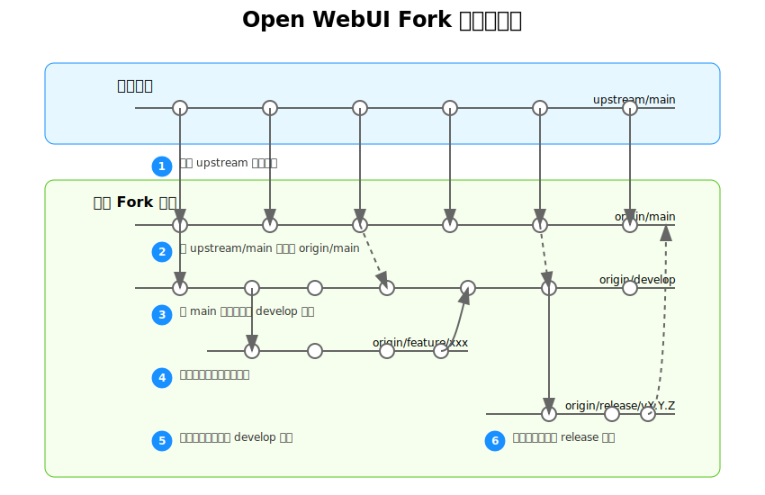

# Open WebUI 二次开发指南

## 目录

- [简介](#简介)
- [分支管理策略](#分支管理策略)
- [环境设置](#环境设置)
- [日常开发流程](#日常开发流程)
- [同步原项目更新](#同步原项目更新)
- [冲突处理策略](#冲突处理策略)
- [代码组织最佳实践](#代码组织最佳实践)
- [自动化工具](#自动化工具)
- [版本发布流程](#版本发布流程)
- [常见问题与解决方案](#常见问题与解决方案)
- [附录：完整命令参考](#附录完整命令参考)

## 简介

本指南旨在提供一套完整的解决方案，使开发者能够在二次开发 Open WebUI 的过程中：

1. 保留原项目的全部功能和内容
2. 随时同步原项目的最新更新
3. 独立开发新功能而不影响原有功能
4. 最小化合并冲突的可能性
5. 维护清晰的代码版本历史

此方案基于 Git 的分支管理策略，结合了持续集成的最佳实践，适用于长期的项目维护和开发。

## 分支管理策略

我们采用"功能分支工作流"(Feature Branch Workflow)结合"上游同步"(Upstream Syncing)的方式来管理代码。

### 分支结构



- **main**: 对应于你fork的项目的主分支，始终与原项目保持同步
- **develop**: 二次开发的主分支，所有新功能都基于此分支开发
- **feature/xxx**: 各个功能的开发分支，完成后合并回develop分支
- **release/vX.X.X**: 准备发布的版本分支，用于最终测试和准备
- **hotfix/xxx**: 紧急修复分支，用于修复已发布版本中的关键问题

### 分支关系与流向

1. 原项目更新 → upstream/main → main → develop
2. 新功能开发：develop → feature/xxx → develop
3. 版本发布：develop → release/vX.X.X → main（标记tag）
4. 紧急修复：main → hotfix/xxx → main和develop

## 环境设置

### 初始设置（首次克隆项目后）

```bash
# 1. 克隆你fork的仓库
git clone https://github.com/你的用户名/open-webui.git
cd open-webui

# 2. 添加原项目作为上游仓库
git remote add upstream https://github.com/原作者/open-webui.git

# 3. 验证远程仓库设置
git remote -v
# 应该显示origin(你的fork)和upstream(原项目)

# 4. 创建develop分支
git checkout -b develop
git push -u origin develop
```

### 仓库配置建议

在项目根目录创建一个 `.git-blame-ignore-revs` 文件，将大型格式化提交的哈希值添加到此文件中，以避免它们在 blame 视图中造成干扰：

```
# 在此文件中添加大型格式化提交的哈希值
# 例如：
a1b2c3d4e5f6g7h8i9j0k1l2m3n4o5p6q7r8s9
```

然后配置你的Git：

```bash
git config blame.ignoreRevsFile .git-blame-ignore-revs
```

## 日常开发流程

### 开始新功能开发

```bash
# 1. 确保develop分支是最新的
git checkout develop
git pull origin develop

# 2. 创建新的功能分支
git checkout -b feature/新功能名称

# 3. 进行开发...

# 4. 定期提交更改
git add .
git commit -m "feature: 描述你的更改"

# 5. 定期推送到远程仓库（备份+团队共享）
git push -u origin feature/新功能名称
```

### 完成功能开发

```bash
# 1. 确保功能分支包含最新的develop更改
git checkout develop
git pull origin develop
git checkout feature/新功能名称
git merge develop
# 解决可能的冲突

# 2. 最终测试

# 3. 合并到develop分支
git checkout develop
git merge --no-ff feature/新功能名称
git push origin develop

# 4. 删除功能分支（可选）
git branch -d feature/新功能名称
git push origin --delete feature/新功能名称
```

## 同步原项目更新

定期同步原项目的更新是保持代码库健康的关键。建议每周至少同步一次，或在原项目有重大更新时立即同步。

### 手动同步流程

```bash
# 1. 切换到main分支
git checkout main

# 2. 获取原始项目最新代码
git fetch upstream

# 3. 确保本地main干净
git reset --hard upstream/main

# 4. 推送到你的fork仓库
git push origin main --force

# 5. 更新develop分支
git checkout develop
git merge main
# 解决可能的冲突
git push origin develop
```

### 脚本自动同步

为了简化同步过程，你可以使用我们提供的同步脚本：

```bash
# 确保脚本有执行权限
chmod +x scripts/sync-upstream.sh

# 运行脚本
./scripts/sync-upstream.sh
```

该脚本会自动完成上述同步流程，并在遇到冲突时提供指导。

### 合并冲突解决过程

1. 使用可视化合并工具：
   ```bash
   git mergetool
   ```

2. 手动解决每个冲突：
   - `<<<<<<< HEAD` 到 `=======` 是当前分支的内容
   - `=======` 到 `>>>>>>> branch-name` 是被合并分支的内容

3. 解决完所有冲突后：
   ```bash
   git add .
   git commit -m "merge: 解决与原项目更新的冲突"
   ```

## 冲突处理策略

### 预防冲突的方法

1. **隔离修改区域**：尽量将你的修改限制在特定的文件或模块中
2. **创建扩展点**：在原代码中添加钩子或扩展点，而不是直接修改核心逻辑
3. **使用配置驱动**：通过配置文件控制功能，而不是硬编码
4. **模块化开发**：将新功能封装为独立模块

### 代码标记

为了清晰区分原代码和你的修改，使用统一的注释标记：

```javascript
// [CUSTOM:BEGIN] 功能描述
// 你的自定义代码...
// [CUSTOM:END]
```

```python
# [CUSTOM:BEGIN] 功能描述
# 你的自定义代码...
# [CUSTOM:END]
```

### 处理复杂冲突

对于难以解决的冲突，考虑以下策略：

1. **重新设计**：如果冲突是由于架构变化引起的，考虑重新设计你的功能
2. **分阶段合并**：将大型合并分解为多个小步骤
3. **临时跳过**：使用 `git merge -s ours` 暂时忽略特定文件的更改
4. **创建适配层**：编写适配代码桥接新旧API

## 代码组织最佳实践

### 文件组织

```
open-webui/
├── app/                  # 原始后端代码
│   ├── custom/           # 你的自定义后端扩展（新建）
│   │   ├── __init__.py   # 使扩展可导入
│   │   ├── routes/       # 自定义路由
│   │   ├── models/       # 自定义数据模型
│   │   └── services/     # 自定义服务
├── frontend/             # 原始前端代码
│   ├── src/
│   │   ├── custom/       # 你的自定义前端组件（新建）
│   │   │   ├── components/
│   │   │   ├── pages/
│   │   │   └── utils/
└── docs/
    ├── custom/           # 你的功能文档（新建）
```

### 扩展点设计

1. **后端扩展**：
   - 使用中间件扩展功能
   - 使用事件钩子响应系统事件
   - 通过插件系统注册新路由

2. **前端扩展**：
   - 使用状态管理扩展
   - 使用组件插槽
   - 实现UI主题系统

### 配置管理

创建自定义配置文件，用于控制你添加的功能：

```python
# app/custom/config.py
CUSTOM_FEATURES = {
    "feature_a": True,
    "feature_b": False,
    # 更多功能开关...
}
```

## 自动化工具

### 自动同步脚本

创建一个自动同步上游更新的脚本：

```bash
#!/bin/bash
# 文件: scripts/sync-upstream.sh

set -e  # 遇到错误立即退出

echo "===== 开始同步上游仓库 ====="

# 保存当前分支
CURRENT_BRANCH=$(git rev-parse --abbrev-ref HEAD)
echo "当前分支: $CURRENT_BRANCH"

# 同步main分支
echo "切换到main分支..."
git checkout main

echo "获取上游更新..."
git fetch upstream

echo "重置main分支到upstream/main..."
git reset --hard upstream/main

echo "强制推送更新到origin/main..."
git push origin main --force

# 同步develop分支
echo "切换到develop分支..."
git checkout develop

echo "合并main分支更新..."
if git merge main --no-edit; then
    echo "自动合并成功，推送更新到origin/develop..."
    git push origin develop
else
    echo "合并冲突，请手动解决冲突后提交..."
    exit 1
fi

# 返回到原始分支
echo "切换回原始分支: $CURRENT_BRANCH"
git checkout $CURRENT_BRANCH

echo "===== 上游同步完成 ====="
```

使脚本可执行：

```bash
chmod +x scripts/sync-upstream.sh
```

### Git Hooks

设置pre-commit钩子来检查代码风格和标记：

```bash
#!/bin/bash
# 文件: .git/hooks/pre-commit

CUSTOM_MARKER="CUSTOM:"
CUSTOM_FILES=$(git diff --cached --name-only)

for FILE in $CUSTOM_FILES; do
    if [ -f "$FILE" ]; then
        # 检查文件中是否有未标记的自定义代码
        # 略...
    fi
done
```

### GitHub Actions 工作流

创建自动同步工作流：

```yaml
# 文件: .github/workflows/sync-upstream.yml
name: Sync Upstream

on:
  schedule:
    - cron: '0 0 * * 0'  # 每周日零点运行
  workflow_dispatch:     # 允许手动触发

jobs:
  sync:
    runs-on: ubuntu-latest
    steps:
      - uses: actions/checkout@v3
        with:
          fetch-depth: 0
      
      # 设置Git
      - name: Setup Git
        run: |
          git config user.name "GitHub Actions"
          git config user.email "actions@github.com"
      
      # 添加上游仓库
      - name: Add Upstream
        run: |
          git remote add upstream https://github.com/原作者/open-webui.git
      
      # 同步main分支
      - name: Sync Main Branch
        run: |
          git checkout main
          git fetch upstream
          git reset --hard upstream/main
          git push origin main --force
      
      # 尝试更新develop分支
      - name: Update Develop Branch
        run: |
          git checkout develop
          git merge main || echo "手动合并需要进行"
          git push origin develop || echo "需要手动推送"
```

## 版本发布流程

### 版本编号规范

采用语义化版本控制 (Semantic Versioning)：

- **主版本号**：不兼容的API修改
- **次版本号**：向后兼容的功能性新增
- **修订号**：向后兼容的问题修正

### 发布流程

1. **准备发布**：
   ```bash
   # 从develop分支创建发布分支
   git checkout develop
   git checkout -b release/v1.2.3
   
   # 更新版本号和更新日志
   # 编辑版本文件...
   
   git add .
   git commit -m "chore: 准备v1.2.3发布"
   ```

2. **测试和修复**：
   ```bash
   # 在发布分支上进行最终测试和修复
   git commit -m "fix: 修复发布前发现的问题"
   ```

3. **完成发布**：
   ```bash
   # 合并到main和develop
   git checkout main
   git merge --no-ff release/v1.2.3 -m "chore: 合并发布v1.2.3"
   git tag -a v1.2.3 -m "v1.2.3"
   git push origin main --tags
   
   git checkout develop
   git merge --no-ff release/v1.2.3 -m "chore: 合并发布v1.2.3回develop"
   git push origin develop
   
   # 删除发布分支
   git branch -d release/v1.2.3
   ```

### 发布清单

- [ ] 更新版本号
- [ ] 更新CHANGELOG.md
- [ ] 更新文档
- [ ] 运行完整测试套件
- [ ] 检查性能退化
- [ ] 创建发布说明
- [ ] 标记Git版本
- [ ] 发布构建产物

## 常见问题与解决方案

### 问题：同步后develop分支有大量冲突

**解决方案**：
1. 考虑使用更小的功能分支，减少一次合并的改动量
2. 创建临时分支进行试验性合并
   ```bash
   git checkout -b temp-merge develop
   git merge main
   # 分析冲突，然后放弃或继续
   ```

### 问题：误删除了重要分支

**解决方案**：
```bash
# 查找被删除分支的最后一次提交
git reflog

# 基于那个提交创建新分支
git checkout -b 恢复的分支名 提交哈希值
```

### 问题：需要回滚到之前的版本

**解决方案**：
```bash
# 软重置（保留更改但不提交）
git reset 目标版本哈希值

# 硬重置（丢弃所有更改）
git reset --hard 目标版本哈希值
```

### 问题：原项目结构发生重大变化

**解决方案**：
1. 创建一个新的过渡分支
2. 手动将你的自定义功能移植到新结构
3. 使用 `git cherry-pick` 选择性地应用特定提交

## 附录：完整命令参考

### 远程仓库管理

```bash
# 查看远程仓库
git remote -v

# 添加上游仓库
git remote add upstream https://github.com/原作者/open-webui.git

# 重命名远程仓库
git remote rename old_name new_name

# 删除远程仓库
git remote remove name
```

### 分支管理

```bash
# 列出所有本地分支
git branch

# 列出所有远程分支
git branch -r

# 列出所有本地和远程分支
git branch -a

# 创建新分支但不切换
git branch branch_name

# 创建并切换到新分支
git checkout -b branch_name

# 删除本地分支
git branch -d branch_name

# 强制删除本地分支
git branch -D branch_name

# 删除远程分支
git push origin --delete branch_name
```

### 同步与合并

```bash
# 获取远程更新但不合并
git fetch remote_name

# 拉取并合并远程更新
git pull remote_name branch_name

# 合并分支
git merge branch_name

# 变基
git rebase branch_name

# 中止合并
git merge --abort

# 中止变基
git rebase --abort
```

### 标签管理

```bash
# 列出所有标签
git tag

# 创建带注释的标签
git tag -a v1.2.3 -m "版本1.2.3"

# 推送特定标签到远程
git push origin v1.2.3

# 推送所有标签到远程
git push origin --tags

# 删除本地标签
git tag -d v1.2.3

# 删除远程标签
git push origin --delete v1.2.3
```

### 高级技巧

```bash
# 暂存当前更改
git stash

# 应用暂存的更改
git stash apply

# 交互式添加
git add -i

# 选择性地提交文件的部分更改
git add -p

# 修改最近的提交
git commit --amend

# 选择性应用其他分支的提交
git cherry-pick commit_hash
``` 