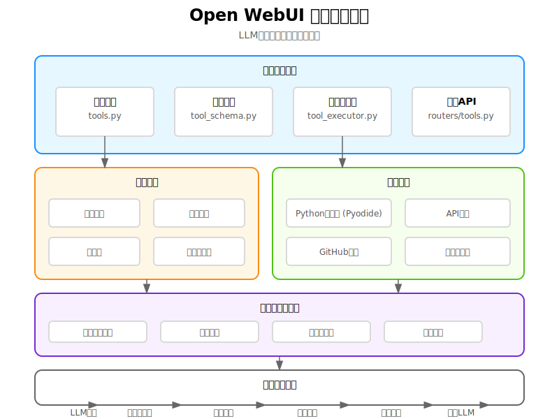
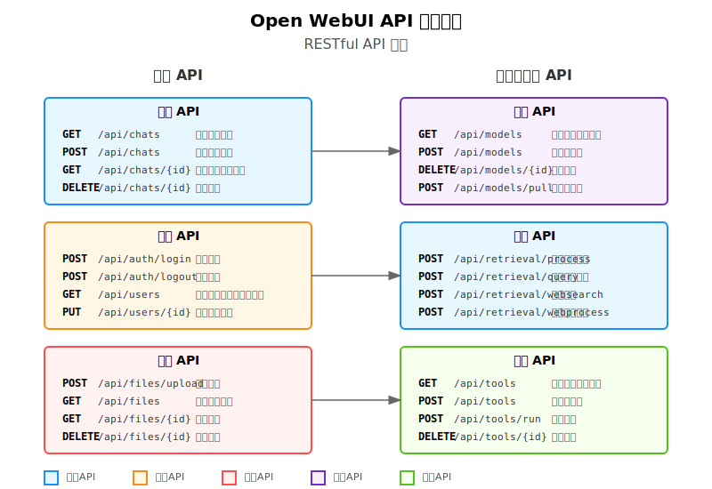
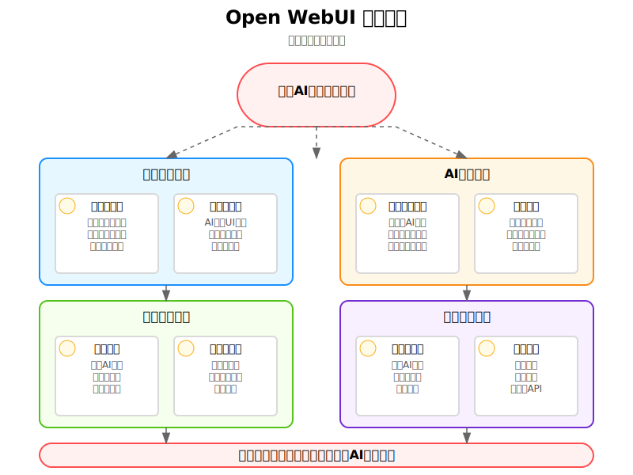

# Open WebUI 项目解读报告

## 目录

- [1. 项目概述](#1-项目概述)
- [2. 技术栈分析](#2-技术栈分析)
- [3. 系统架构](#3-系统架构)
- [4. 核心功能解析](#4-核心功能解析)
- [5. 数据模型设计](#5-数据模型设计)
- [6. API 接口设计](#6-api-接口设计)
- [7. 前端界面设计](#7-前端界面设计)
- [8. 安全性考虑](#8-安全性考虑)
- [9. 可扩展性设计](#9-可扩展性设计)
- [10. 二次开发建议](#10-二次开发建议)
- [11. 总结](#11-总结)

## 1. 项目概述

Open WebUI 是一个可扩展、功能丰富、用户友好的自托管 AI 平台，专为完全离线操作而设计。它支持多种 LLM 运行器，包括 Ollama 和 OpenAI 兼容的 API，并具有内置推理引擎用于 RAG（检索增强生成），使其成为一个强大的 AI 部署解决方案。

该项目采用前后端分离架构，前端使用 Svelte 框架开发，后端使用 Python 的 FastAPI 框架构建，形成了一个现代化的全栈应用。

## 2. 技术栈分析

### 2.1 前端技术栈

- **框架**: SvelteKit - 构建现代化、高性能的前端应用
- **样式库**: TailwindCSS - 用于快速构建美观的用户界面
- **状态管理**: Svelte 内置的状态管理 (store)
- **UI 组件**: 自定义组件，结合了 bits-ui 等组件库
- **国际化**: i18next - 支持多语言界面
- **HTTP 客户端**: 原生 fetch API
- **WebSocket**: socket.io-client - 用于实时通信
- **代码编辑器**: CodeMirror - 用于编写和显示代码
- **数学公式渲染**: KaTeX - 支持 LaTeX 语法
- **图表生成**: Mermaid - 用于生成流程图和图表
- **Python 运行**: Pyodide - 浏览器中运行 Python 代码

### 2.2 后端技术栈

- **框架**: FastAPI - 高性能的 Python Web 框架
- **数据库**: SQLAlchemy ORM - 用于数据库交互
- **数据模型**: Pydantic - 用于数据验证和序列化
- **认证**: 自定义认证系统，支持多种认证方式
- **Web Socket**: socket.io - 用于实时通信
- **任务队列**: 内置任务管理系统
- **RAG 技术**: 内置的检索增强生成模块
- **AI 集成**: 支持 Ollama 和 OpenAI 兼容的 API

## 3. 系统架构

### 3.1 整体架构

Open WebUI 采用典型的前后端分离架构，具有以下主要组件：

1. **前端应用** - Svelte 构建的 Web 界面
2. **后端 API 服务** - FastAPI 构建的 REST API
3. **WebSocket 服务** - 用于实时通信
4. **数据库** - 存储用户、聊天、模型等数据
5. **外部 AI 服务集成** - 与 Ollama、OpenAI 等 AI 服务的集成
6. **文件存储** - 用于存储用户上传的文档和文件

整个系统设计为模块化和可扩展的，允许添加新功能和集成新的模型运行器。

### 3.2 数据流

1. 用户通过前端界面发起请求
2. 请求通过 API 或 WebSocket 发送到后端
3. 后端处理请求，可能调用外部 AI 服务
4. 响应返回给前端，实时数据通过 WebSocket 传输
5. 前端更新 UI 显示结果

### 3.3 模块组织

前端模块主要包括：
- 聊天界面 (`chat`)
- 模型选择器 (`ModelSelector`)
- 消息输入和显示 (`MessageInput`, `Messages`)
- 管理界面 (`admin`)
- 工作区 (`workspace`)
- 各种实用工具 (`utils`)

后端模块主要包括：
- API 路由器 (`routers`)
- 数据模型 (`models`)
- 数据库交互 (`internal/db`)
- RAG 实现 (`retrieval`)
- WebSocket 处理 (`socket`)
- 用户认证 (`auths`)

## 4. 核心功能解析

### 4.1 聊天系统

聊天系统是 Open WebUI 的核心功能，实现了与各种 LLM 的交互。主要组件和功能包括：

- **Chat.svelte**: 主聊天组件，管理消息流、用户输入和模型响应
- **Messages.svelte**: 负责渲染消息历史
- **MessageInput.svelte**: 提供用户输入界面，支持文本、语音和其他输入方式
- **后端聊天 API**: 在 `routers/chats.py` 和 `main.py` 中实现了聊天操作的 API 端点

聊天功能支持多种模型，包括 Ollama 和 OpenAI 兼容的模型。它还支持流式响应，允许模型生成的文本实时显示。

### 4.2 用户认证和权限系统

Open WebUI 实现了完整的用户认证和基于角色的访问控制 (RBAC) 系统：

- **用户模型**: 在 `models/users.py` 中定义
- **认证路由**: 在 `routers/auths.py` 中实现
- **权限检查**: 通过中间件和依赖项实现
- **支持多种认证方式**: 包括本地认证和 OAuth

系统支持用户组和详细的权限设置，允许管理员控制谁可以访问特定功能。

### 4.3 检索增强生成 (RAG)

RAG 功能允许模型基于外部文档和网络资源生成回答：

- **文档处理**: 支持上传和处理各种文档类型
- **网络搜索**: 集成多种搜索引擎，如 SearXNG、Google PSE 等
- **嵌入生成**: 使用模型生成文本嵌入用于相似度搜索
- **相关内容检索**: 在回答问题时检索相关上下文

RAG 实现位于 `routers/retrieval.py` 中，是项目的一个强大功能。

### 4.4 模型管理

系统提供完整的模型管理功能：

- **模型列表**: 显示可用模型
- **模型选择**: 在聊天中选择要使用的模型
- **模型创建**: 通过 Ollama 创建自定义模型
- **模型控制**: 管理员可以控制模型访问权限

模型管理功能分布在前端的 `ModelSelector` 组件和后端的 `routers/models.py` 和 `routers/ollama.py` 中。

### 4.5 工具集成

Open WebUI 支持多种工具集成，扩展了 AI 的能力：

- **Python 函数调用**: 允许 LLM 调用 Python 函数
- **Web 浏览**: 允许 AI 浏览网页内容
- **图像生成**: 集成 AUTOMATIC1111 API 和 ComfyUI 等图像生成工具
- **插件支持**: 通过 Pipelines 框架支持插件开发

工具功能实现主要在 `routers/tools.py` 和前端的 `workspace` 组件中。

## 5. 数据模型设计

项目使用 SQLAlchemy ORM 定义数据模型，主要实体包括：

- **用户 (Users)**: 存储用户信息和认证数据
- **聊天 (Chats)**: 存储聊天历史和内容
- **消息 (Messages)**: 存储聊天中的单个消息
- **模型 (Models)**: 存储 AI 模型信息
- **文件 (Files)**: 存储上传的文件信息
- **函数 (Functions)**: 存储可调用的 Python 函数
- **标签 (Tags)**: 用于组织和分类聊天
- **文件夹 (Folders)**: 用于组织聊天和文件
- **群组 (Groups)**: 用于用户权限管理

数据模型设计合理，支持项目的各种功能需求，同时提供了良好的可扩展性。

## 6. API 接口设计

Open WebUI 提供了丰富的 API 接口，包括：

- **聊天 API**: 创建、获取、更新和删除聊天
- **用户 API**: 用户管理和认证
- **模型 API**: 模型管理和控制
- **文件 API**: 文件上传和管理
- **检索 API**: RAG 功能相关的接口
- **工具 API**: 访问和使用各种工具的接口

API 设计遵循 RESTful 原则，使用 JSON 作为数据交换格式，并提供详细的错误处理。

## 7. 前端界面设计

前端界面使用 Svelte 和 TailwindCSS 构建，具有以下特点：

- **响应式设计**: 适应不同屏幕尺寸，包括移动设备
- **功能丰富的聊天界面**: 支持 Markdown、LaTeX、代码高亮等
- **模型选择器**: 方便地切换不同的 AI 模型
- **设置界面**: 自定义用户体验
- **管理界面**: 管理员控制系统设置
- **暗色/亮色模式**: 支持切换界面主题

界面设计简洁直观，同时提供丰富的功能，满足不同用户的需求。

## 8. 安全性考虑

项目在安全方面做了多种考虑：

- **用户认证**: 支持多种认证方式，保护用户账户
- **权限控制**: 基于角色的访问控制系统
- **API 安全**: 使用令牌认证保护 API 访问
- **数据验证**: 使用 Pydantic 验证输入数据
- **环境变量**: 敏感配置通过环境变量管理
- **错误处理**: 适当的错误处理防止信息泄露

## 9. 可扩展性设计

Open WebUI 设计为高度可扩展的系统：

- **模块化架构**: 功能封装在独立模块中
- **插件支持**: 通过 Pipelines 框架支持插件开发
- **API 设计**: 清晰的 API 允许外部集成
- **工具集成**: 易于添加新的工具和功能
- **模型适配**: 支持添加新的 AI 模型和提供者

## 10. 二次开发建议

基于对项目的分析，以下是进行二次开发的建议：

### 10.1 最佳入口点

1. **添加新的聊天功能**:
   - 在 `src/lib/components/chat` 中扩展聊天组件
   - 在 `backend/open_webui/routers/chats.py` 中添加新的 API 端点

2. **集成新的模型提供者**:
   - 创建新的适配器模块，类似于 `routers/ollama.py` 和 `routers/openai.py`
   - 在 `src/lib/apis` 中添加相应的前端 API 调用

3. **开发自定义工具**:
   - 在 `routers/tools.py` 中添加新的工具定义
   - 在前端 `src/lib/components/workspace` 中创建工具界面

4. **扩展 RAG 能力**:
   - 修改 `routers/retrieval.py` 以添加新的检索方法
   - 添加对新文档类型的支持

### 10.2 开发流程建议

1. **环境设置**:
   - 使用 Docker 快速设置开发环境
   - 按照 README 中的说明配置前后端开发环境

2. **代码组织**:
   - 遵循项目的现有结构，保持模块化
   - 新功能应作为独立模块添加

3. **测试策略**:
   - 为新功能编写单元测试
   - 进行集成测试确保与现有系统兼容

4. **部署考虑**:
   - 考虑使用 Docker 容器化新功能
   - 确保环境变量配置完整

### 10.3 创新功能建议

1. **多模态 RAG**:
   - 扩展 RAG 系统以支持图像和视频理解
   - 结合文本和图像生成更全面的回答

2. **高级对话管理**:
   - 实现对话摘要和分类功能
   - 添加对话记忆优化功能

3. **企业集成**:
   - 添加企业常用应用的集成，如 CRM、ERP 等
   - 实现数据库查询功能，允许 AI 直接访问结构化数据

4. **批量处理功能**:
   - 开发批量文件处理和回答生成功能
   - 实现队列和异步处理机制

5. **高级分析功能**:
   - 添加对话分析工具，提供使用统计和见解
   - 开发模型性能评估和比较功能

## 11. 总结

Open WebUI 是一个功能丰富、架构良好、高度可扩展的 AI 平台。它提供了与多种 LLM 的集成，强大的 RAG 功能，以及丰富的工具支持。

项目采用前后端分离架构，前端使用 Svelte 构建现代化用户界面，后端使用 FastAPI 提供高性能 API。数据通过 SQLAlchemy ORM 存储在数据库中，同时支持文件存储。

该项目为二次开发提供了良好的基础，允许开发者添加新功能，集成新的模型提供者，或扩展现有功能。通过遵循项目的架构和设计原则，开发者可以创建创新的 AI 应用，满足各种需求。

凭借其开源性质和活跃的社区支持，Open WebUI 将继续发展，成为 AI 应用开发的重要平台。

 