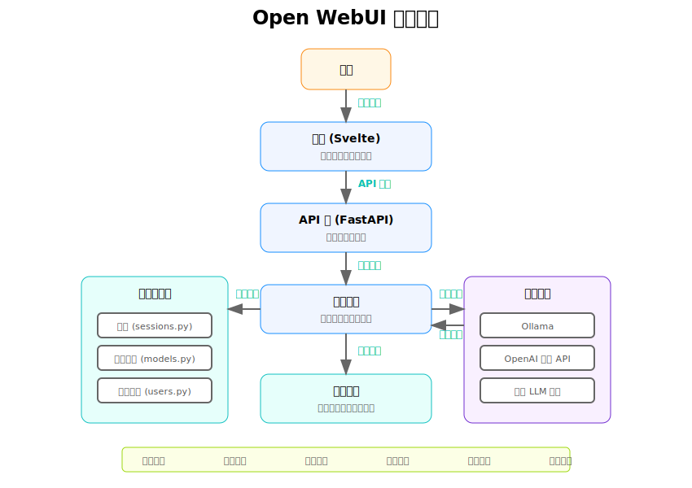
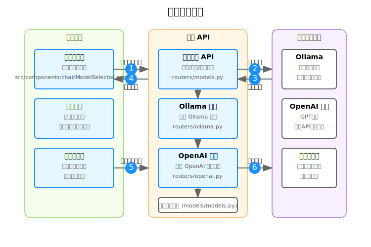

# Open WebUI 项目报告

## 1. 项目概述

Open WebUI 是一个开源的 Web 界面，为各种大型语言模型（LLM）提供了现代化的交互方式。该项目旨在创建一个功能丰富、易于使用的界面，使用户能够与 Ollama、OpenAI 及其他兼容 API 的语言模型进行交互。项目使用 Svelte 作为前端框架，FastAPI 作为后端框架，实现了一个灵活、可扩展的架构。

### 1.1 项目目标

- 提供直观、响应式的用户界面，简化与 LLM 的交互
- 支持多种语言模型和 API 格式
- 实现高级功能，如文档检索、知识库管理、多模态交互等
- 确保系统的可扩展性和可定制性
- 优化性能，提供流畅的用户体验

### 1.2 核心特性

- **多模型支持**：与 Ollama、OpenAI 和其他兼容 API 的服务集成
- **聊天界面**：直观的对话式界面，支持 Markdown、代码高亮等
- **高级检索**：通过 RAG（检索增强生成）提高回答的准确性
- **文件管理**：上传、管理和处理各种文件格式
- **工具集成**：与外部工具和服务的集成
- **多用户支持**：用户管理和权限控制
- **响应式设计**：适用于不同设备和屏幕尺寸

## 2. 架构设计

### 2.1 系统架构

Open WebUI 采用前后端分离的架构，由以下主要组件构成：

- **前端**：基于 Svelte 框架构建的单页应用（SPA）
- **后端**：使用 FastAPI 构建的 RESTful API 服务
- **数据存储**：使用 SQLite 和文件系统存储数据和配置
- **模型集成**：与各种 LLM API 的接口


### 2.2 前端架构

前端采用 Svelte 框架，具有以下特点：

- **组件化**：将 UI 分解为可重用的组件
- **响应式**：自动更新 DOM 以反映数据变化
- **轻量级**：体积小，性能高
- **状态管理**：使用 Svelte 的内置状态管理

关键组件包括：

- 聊天界面（Chat.svelte）
- 模型选择器（ModelSelector.svelte）
- 设置界面（Settings.svelte）
- 文件管理界面（Files.svelte）

### 2.3 后端架构

后端采用 FastAPI 框架，具有以下特点：

- **异步处理**：高性能异步 API
- **自动文档**：自动生成 API 文档
- **类型提示**：强类型支持
- **依赖注入**：简化组件之间的依赖关系

主要模块包括：

- **路由**：处理 HTTP 请求（routers/）
- **模型**：数据模型和架构（models/）
- **服务**：业务逻辑（services/）
- **工具**：实用工具和辅助函数（utils/）

### 2.4 API 设计

Open WebUI 提供了一组 RESTful API，用于前端与后端的通信，主要包括以下几类：

- **聊天 API**：用于发送消息和接收回复
- **模型 API**：用于模型管理和配置
- **文件 API**：用于文件上传和管理
- **用户 API**：用于用户认证和管理
- **设置 API**：用于系统配置


## 3. 数据流

### 3.1 数据流概述

Open WebUI 中的数据流可以分为以下几个主要部分：

1. **用户交互流**：用户通过界面进行操作，前端通过 API 将请求发送到后端
2. **模型交互流**：后端通过 API 与语言模型进行交互，获取响应
3. **数据持久化流**：系统将数据存储到数据库或文件系统中
4. **文件处理流**：处理上传的文件，进行索引和管理



### 3.2 关键数据模型

系统使用了以下主要数据模型：

- **User**：用户信息和认证数据
- **Conversation**：对话信息和历史记录
- **Message**：单条消息的内容和元数据
- **Model**：语言模型的配置和参数
- **File**：文件信息和元数据
- **Setting**：系统配置和用户偏好

## 4. 模型管理

### 4.1 模型管理架构

Open WebUI 实现了一个灵活的模型管理系统，支持多种类型的模型和 API。主要包括以下组件：

- **模型选择器**：用于选择和切换模型
- **模型配置**：设置模型参数和选项
- **模型集成**：与不同模型 API 的集成



### 4.2 支持的模型类型

系统支持以下几类模型：

- **Ollama 模型**：本地运行的开源模型
- **OpenAI 兼容 API**：包括 OpenAI、Azure OpenAI 等
- **自定义 API**：兼容 OpenAI API 格式的其他服务

### 4.3 模型参数配置

系统支持调整各种模型参数，如：

- **Temperature**：控制输出的随机性
- **Top_p**：控制输出的多样性
- **Max Tokens**：控制回复的最大长度
- **Presence/Frequency Penalty**：控制重复内容的惩罚

## 5. 用户体验

### 5.1 用户界面设计

Open WebUI 的用户界面设计遵循以下原则：

- **简洁直观**：清晰的视觉层次和导航
- **响应式**：适应不同屏幕尺寸和设备
- **功能性**：将复杂功能简化为直观的交互
- **一致性**：保持整个应用的视觉和交互一致性


### 5.2 用户流程

系统设计了多个用户流程，包括：

- **对话流程**：从开始聊天到获取回复的完整流程
- **文件上传流程**：上传、处理和引用文件的流程
- **模型选择流程**：浏览、选择和配置模型的流程
- **设置流程**：配置系统和个人偏好的流程

### 5.3 响应式设计

系统实现了全面的响应式设计，确保在以下设备上提供良好的用户体验：

- 桌面电脑
- 笔记本电脑
- 平板电脑
- 智能手机

## 6. 核心功能详解

### 6.1 聊天功能

聊天功能是系统的核心，包括以下主要特性：

- **消息发送和接收**：与模型进行实时交互
- **流式响应**：边生成边显示回复内容
- **上下文管理**：维护对话上下文，支持连续对话
- **格式化支持**：支持 Markdown、代码高亮等
- **历史记录**：保存和查看历史对话

### 6.2 检索增强生成 (RAG)

系统实现了检索增强生成功能，通过以下步骤提高模型回答的准确性：

1. **文档索引**：对上传的文档进行处理和索引
2. **相关内容检索**：根据用户问题检索相关文档片段
3. **上下文增强**：将检索到的内容加入到模型提示中
4. **生成回答**：模型基于增强的上下文生成回答

### 6.3 文件管理

文件管理功能允许用户上传和管理各种类型的文件：

- **文件上传**：支持多种文件格式（PDF、TXT、DOCX 等）
- **文件处理**：自动处理和解析文件内容
- **文件索引**：为检索功能创建索引
- **文件引用**：在对话中引用文件内容

### 6.4 用户管理

系统实现了基本的用户管理功能：

- **用户认证**：登录和身份验证
- **用户配置**：个人设置和偏好
- **权限控制**：控制用户对不同功能的访问权限

## 7. 技术栈

### 7.1 前端技术

- **Svelte**: 前端框架
- **TailwindCSS**: CSS 框架
- **TypeScript**: 类型化的 JavaScript
- **SvelteKit**: Svelte 应用框架
- **Vite**: 构建工具

### 7.2 后端技术

- **Python**: 主要编程语言
- **FastAPI**: Web 框架
- **SQLite**: 轻量级数据库
- **Pydantic**: 数据验证
- **HTTPX**: 异步 HTTP 客户端

### 7.3 开发工具

- **Git**: 版本控制
- **Docker**: 容器化
- **Uvicorn**: ASGI 服务器
- **Pytest**: 测试框架

## 8. 未来发展方向

以下是 Open WebUI 未来可能的发展方向：

1. **更多模型支持**：集成更多的语言模型和 API
2. **高级协作功能**：实时协作和共享
3. **插件系统**：可扩展的插件架构
4. **多模态交互**：支持图像、音频等多模态输入和输出
5. **更多工具集成**：与更多外部工具和服务的集成
6. **高级分析**：提供使用统计和分析
7. **自定义训练**：支持模型微调和自定义

## 9. 总结

Open WebUI 是一个功能强大、设计精良的开源项目，为大型语言模型提供了直观的界面和丰富的功能。通过前后端分离的架构，系统实现了高度的可扩展性和可定制性，能够满足不同用户的需求。

项目的核心优势在于其灵活的模型支持、直观的用户界面和丰富的功能集。未来，随着更多功能的加入和社区的参与，Open WebUI 有望成为 AI 交互领域的重要工具。

## 附录：文件结构

```
open-webui/
├── src/                    # 前端源代码
│   ├── lib/               # 共享库和组件
│   │   ├── components/    # UI 组件
│   │   └── utils/        # 工具函数
│   └── routes/           # 页面路由
├── backend/               # 后端源代码
│   ├── routers/          # API 路由
│   ├── models/           # 数据模型
│   ├── internal/         # 内部模块
│   └── utils/            # 工具函数
├── static/               # 静态资源
├── docs/                 # 项目文档
├── scripts/              # 脚本文件
├── test/                 # 测试文件
└── kubernetes/           # Kubernetes 配置
``` 